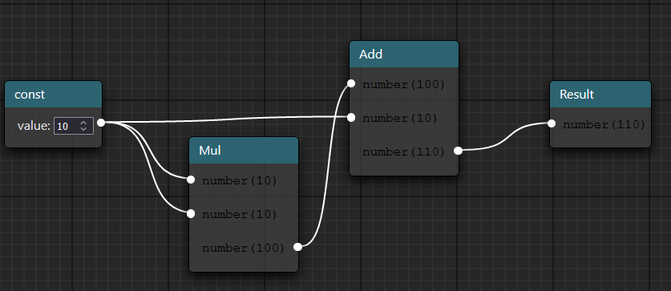
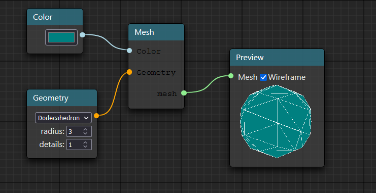

# Graph.exe



# Install 

```
npm install graph.exe-core graph.exe-react
```

# Documentation & Quick Start Guides

[Documentation](https://lexyna.github.io/graph.exe-core/)

# Basic Use (React plugin example)

### Create Input/Output Ports

```ts
  export const numberIn: ProtoIO<null, number> = {
    type: "number",
    label: "number",
    mapping: CON_MAPPING.SINGLE,
    extra: null,
    value: 0,
    data: null,
}

  export const numberOut: ProtoIO<null, number> = {
    type: "number",
    label: "number",
    mapping: CON_MAPPING.MULTI,
    extra: null,
    value: 0,
    data: null,
}
```

### Define Config Nodes

```ts
export const rootNode: ProtoNode = {
    id: "root",
    description: "Root",
    name: "root",
    inputs: [numberIn],
    outputs: [],
    private: true,
    exe: function (in1: EngineIO<null, number>) {
        console.log("received: ", in1.value);
    }
}

export const addNode: ProtoNode = {
    id: "addNode",
    description: "Adds two numbers",
    name: "Add",
    inputs: [numberIn, numberIn],
    outputs: [numberOut],
    exe: function (in1: EngineIO<null, number>, in2: EngineIO<null, number>, out: EngineIO<null, number>) {
        out.value = in1.value + in2.value;
    }
}

export const constNode: ProtoNode = {
    id: "constNode",
    description: "Outputs 1",
    name: "COnst 1",
    inputs: [],
    outputs: [numberOut],
    exe: function (out: EngineIO<null, number>) {
        out.value = 1;
    }
}
```

### Create the configurations

```ts
const config: ProtoNodeDict = {
  "root": rootEngineNode,
  "addNode": addNode,
  "constNode": constNode,
}

//Creates engineNode of our root
const rootEngineNode = buildEngineNode(rootNode, true);

const nodes: ProtoEngineNodeDict = {
    [rootEngineNode.id]: rootEngineNode //Predefining out nodes
};

const connections: EngineConnections = {
  input: {},
  output: {}
}
```

### Create your component

```tsx
<NodeEditor config={config} nodes={nodes} connections={connections} debugMode={true} entryId={rootEngineNode.id}></NodeEditor>
```

# License

MIT © [Lexyna](https://github.com/Lexyna)